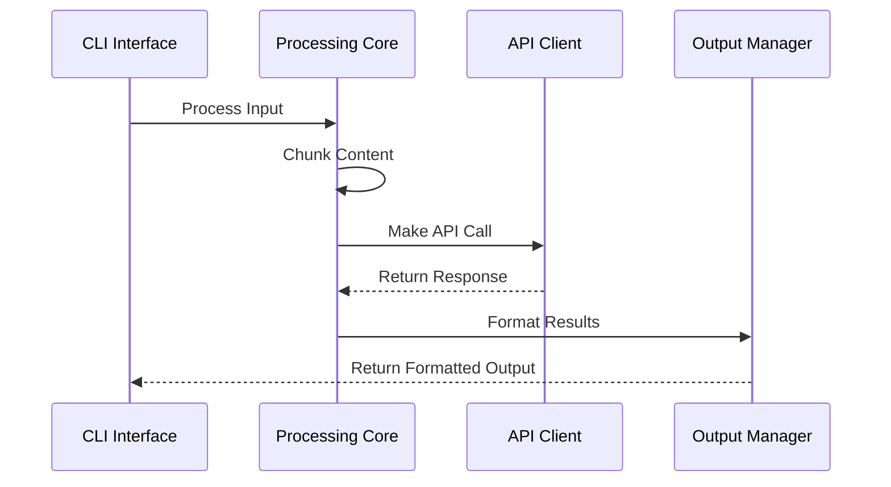
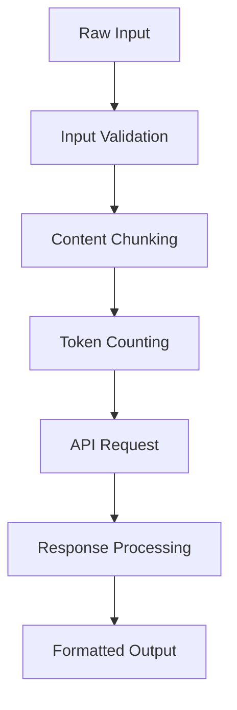
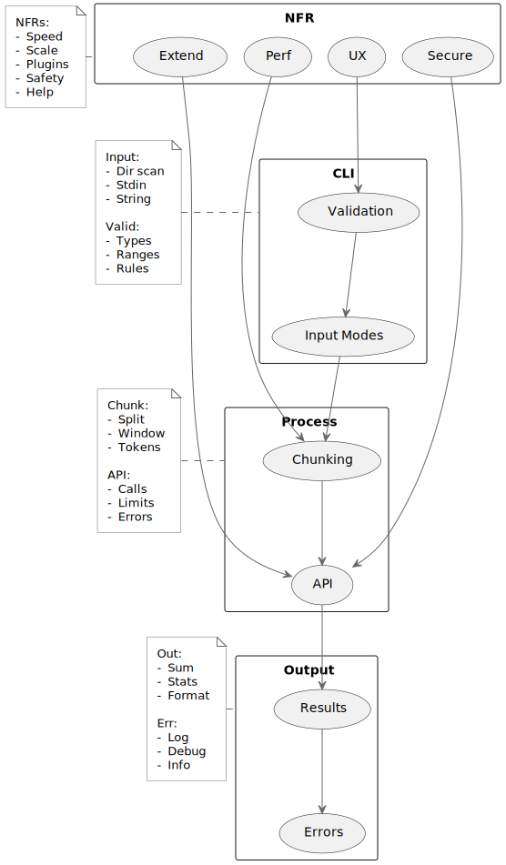
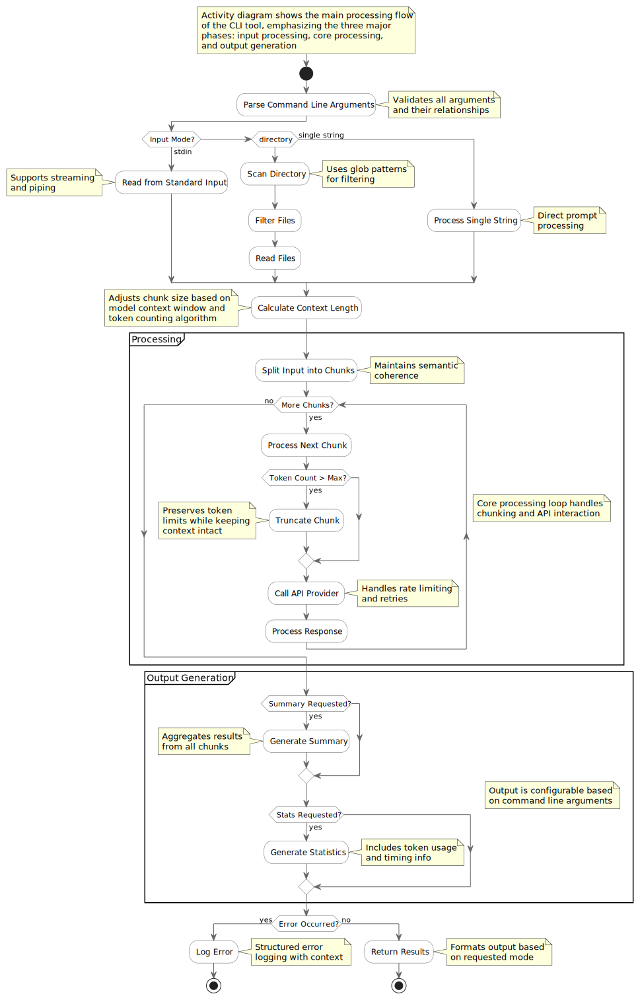

# Architecture Documentation

## Overview

The Command Line Language Model (CLLM) tool is designed with a clear separation of concerns and modular architecture. Below we explore the system through different architectural views and patterns.

## Component Interactions

The CLLM system consists of several key components that interact to process user inputs and generate responses:

1. **CLI Interface Layer**
   - Handles argument parsing and validation
   - Manages input modes (directory, stdin, single string)
   - Coordinates with other components through clean interfaces

2. **Processing Core**
   - Token Manager: Handles token counting and context management
   - Chunking Engine: Splits input based on context windows
   - API Client: Manages communication with language model providers

3. **Output Management**
   - Results Formatter: Structures API responses
   - Error Handler: Manages error states and recovery
   - Progress Tracker: Monitors and reports processing status

### Interaction Patterns


## Data Flows

The system processes data through several stages:

1. **Input Processing Flow**
   - Raw input (files/stdin) → Validated input chunks
   - Argument validation → Processing configuration
   - Environment variables → API configuration

2. **Core Processing Flow**
   - Input chunks → Tokenized content
   - Tokens → API requests
   - API responses → Processed results

3. **Output Generation Flow**
   - Processed results → Formatted output
   - Error states → Error messages
   - Progress updates → Status indicators

### Data Transformation


## Performance Considerations

The architecture implements several performance optimizations:

1. **Memory Management**
   - Streaming processing for large inputs
   - Efficient chunking algorithms
   - Memory-conscious token counting

2. **Processing Optimization**
   - Parallel processing capabilities
   - Batch processing for multiple files
   - Caching of token counts

3. **API Efficiency**
   - Rate limit management
   - Request batching
   - Response caching

### Performance Monitoring
- Token usage tracking
- Processing time metrics
- Memory usage monitoring
- API call statistics

## Deployment Patterns

The system supports various deployment configurations:

1. **Local Installation**
   ```bash
   pipx install .  # Isolated environment
   pip install .   # System-wide installation
   pip install -e .  # Development mode
   ```

2. **Environment Configuration**
   - `.env` file support
   - Environment variable overrides
   - Multiple provider configurations

3. **Integration Patterns**
   - CI/CD pipeline integration
   - Automated processing workflows
   - Batch processing systems

### Security Considerations
- Secure credential management
- API key rotation
- Access control patterns

## Requirements View



The requirements diagram illustrates the key components and their relationships.

## Activity View



The activity diagram shows the main processing flow through the system.

## Design Decisions

The architecture reflects several key design decisions:

1. **Separation of Concerns**: Each major component (CLI, Processing, Output) is isolated with clear interfaces.
2. **Flexible Input Processing**: Multiple input modes support various usage scenarios.
3. **Robust Error Handling**: Comprehensive error handling at each layer.
4. **Extensible Architecture**: Plugin system and provider abstraction for future expansion.
5. **Performance Focus**: Efficient handling of large inputs with memory management.
6. **Ontology Framework Integration**: 
   - Soft links to core framework ontologies
   - Relative path-based prefix declarations
   - Loose coupling for independent evolution
   - Reuse of common semantic patterns

The ontology dependencies are visualized in the [Ontology Documentation](ontology.md#framework-dependencies).

## Implementation Notes

The architectural diagrams are implemented using PlantUML with specific layout considerations:
- Vertical flow emphasizes the processing pipeline
- Left-aligned notes provide context
- Concise labeling maintains clarity
- Together blocks ensure related components stay grouped

## Future Considerations

The architecture supports several potential enhancements:
1. Additional language model providers
2. Custom chunking strategies
3. Enhanced plugin capabilities
4. Advanced caching mechanisms
5. Parallel processing options

## Related Documentation
- [Main README](../README.md) - Installation and basic usage
- [Ontology Documentation](ontology.md) - Ontology structure and patterns
- [API Documentation](../docs/api.md) - Detailed API integration guide
- [Plugin Development](../docs/plugins.md) - Guide for extending functionality 