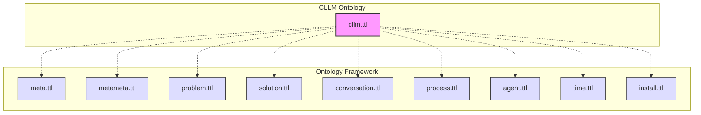

# Ontology Documentation

## Overview

The CLLM ontology provides a semantic model of the Command Line Language Model tool, capturing its components, relationships, and constraints. This document covers the ontology structure, extension patterns, and validation rules.

The ontology is part of the [CLLM project](https://github.com/m9e/cllm) by Matt Wallace, with ontology and documentation contributions being submitted back to the upstream repository.

### Ontology Metadata
```turtle
cllm: a owl:Ontology ;
    rdfs:label "CLLM Ontology"@en ;
    dc:creator [
        a foaf:Person ;
        foaf:name "Matt Wallace" ;
        rdfs:comment "Primary author and maintainer"@en
    ] ;
    dc:source <https://github.com/m9e/cllm> .
```

## Framework Dependencies

The CLLM ontology is built on top of the ontology-framework, using "soft links" to reference core framework ontologies. This approach allows for flexible evolution while maintaining semantic connections.

### Core Framework Dependencies


### Framework Integration

1. **Prefix Declarations**
   ```turtle
   @prefix meta: <./meta#> .
   @prefix metameta: <./metameta#> .
   @prefix problem: <./problem#> .
   @prefix solution: <./solution#> .
   @prefix conversation: <./conversation#> .
   @prefix process: <./process#> .
   @prefix agent: <./agent#> .
   @prefix time: <./time#> .
   @prefix install: <./install#> .
   ```

2. **Soft Linking Pattern**
   - Uses relative paths in prefix declarations
   - Maintains loose coupling with framework
   - Allows for independent evolution

3. **Framework Benefits**
   - Reuse of common concepts
   - Standardized modeling patterns
   - Validated constraint definitions
   - Semantic interoperability

### Setting Up Framework Links

The ontology framework dependencies are managed through symlinks. A setup script is provided to automatically create these links:

1. **Prerequisites**
   ```bash
   # Clone the ontology framework repository
   cd ..
   git clone https://github.com/louspringer/ontology-framework.git
   cd cllm
   ```

2. **Running the Setup Script**
   ```bash
   # Create symlinks to framework ontologies
   python ontology/setup_symlinks.py
   ```

The script will:
- Verify the ontology framework is present
- Create symlinks for each required ontology
- Maintain relative paths for portability

3. **Verifying Links**
   ```bash
   # List symlinks in ontology directory
   ls -la ontology/*.ttl
   ```

Expected output should show symlinks to framework ontologies:
```
meta.ttl -> ../../ontology-framework/meta.ttl
metameta.ttl -> ../../ontology-framework/metameta.ttl
problem.ttl -> ../../ontology-framework/problem.ttl
...
```

## Ontology Extension Patterns

### Adding New Components

1. **Define New Classes**
   ```turtle
   cllm:NewComponent a owl:Class ;
       rdfs:label "New Component"@en ;
       rdfs:comment "Description of the new component"@en .
   ```

2. **Add Properties**
   ```turtle
   cllm:hasNewProperty a owl:ObjectProperty ;
       rdfs:domain cllm:ExistingClass ;
       rdfs:range cllm:NewComponent ;
       rdfs:comment "Description of the property"@en .
   ```

3. **Create Individuals**
   ```turtle
   cllm:ExampleInstance a cllm:NewComponent ;
       rdfs:label "Example Instance"@en ;
       cllm:hasNewProperty cllm:AnotherInstance .
   ```

### Extension Best Practices

1. **Class Hierarchy**
   - Extend existing base classes when possible
   - Use clear naming conventions
   - Include comprehensive labels and comments

2. **Property Relationships**
   - Define clear domains and ranges
   - Consider property characteristics (symmetric, transitive, etc.)
   - Document property constraints

3. **Validation Rules**
   - Add SHACL shapes for new classes
   - Define property constraints
   - Include cardinality rules

## Provider and Model Guide

### Adding New Providers

1. **Define Provider Class**
   ```turtle
   cllm:NewProvider a cllm:APIProvider ;
       rdfs:label "New Provider"@en ;
       rdfs:comment "Description of the provider"@en ;
       cllm:hasEndpoint cllm:NewProviderEndpoint ;
       cllm:hasRateLimit cllm:NewProviderRateLimit .
   ```

2. **Configure Endpoints**
   ```turtle
   cllm:NewProviderEndpoint a cllm:APIEndpoint ;
       rdfs:label "New Provider Endpoint"@en ;
       cllm:endpointUrl "https://api.newprovider.com/v1"^^xsd:string ;
       cllm:requiresAuthentication true .
   ```

3. **Set Rate Limits**
   ```turtle
   cllm:NewProviderRateLimit a cllm:RateLimitPolicy ;
       rdfs:label "New Provider Rate Limit"@en ;
       cllm:requestsPerMinute 60 ;
       cllm:retryAfter 20 .
   ```

### Adding New Models

1. **Define Model Class**
   ```turtle
   cllm:NewModel a cllm:Model ;
       rdfs:label "New Model"@en ;
       rdfs:comment "Description of the model"@en ;
       cllm:maxTokens 4096 ;
       cllm:provider cllm:NewProvider .
   ```

2. **Configure Model Properties**
   ```turtle
   cllm:NewModel
       cllm:hasTokenizationStrategy cllm:CustomTokenization ;
       cllm:supportsSummary true ;
       cllm:supportsSystemPrompt false .
   ```

## Validation Rules

### SHACL Shapes

1. **Class Validation**
   ```turtle
   cllm:APIProviderShape a sh:NodeShape ;
       sh:targetClass cllm:APIProvider ;
       sh:property [
           sh:path cllm:hasEndpoint ;
           sh:minCount 1 ;
           sh:maxCount 1 ;
       ] .
   ```

2. **Property Constraints**
   ```turtle
   cllm:ModelShape a sh:NodeShape ;
       sh:targetClass cllm:Model ;
       sh:property [
           sh:path cllm:maxTokens ;
           sh:datatype xsd:integer ;
           sh:minInclusive 1 ;
       ] .
   ```

3. **Relationship Rules**
   ```turtle
   cllm:CLIArgumentShape a sh:NodeShape ;
       sh:targetClass cllm:CLIArgument ;
       sh:property [
           sh:path cllm:argumentType ;
           sh:minCount 1 ;
           sh:maxCount 1 ;
       ] .
   ```

### Validation Best Practices

1. **Required Properties**
   - Always include labels and comments
   - Specify domains and ranges
   - Define cardinality constraints

2. **Data Validation**
   - Use appropriate datatypes
   - Include range constraints
   - Define pattern restrictions

3. **Relationship Validation**
   - Enforce required relationships
   - Validate relationship targets
   - Check for circular dependencies

## Implementation Examples

### Basic Extension
```turtle
# Add new processing mode
cllm:StreamingMode a cllm:ProcessingMode ;
    rdfs:label "Streaming Mode"@en ;
    rdfs:comment "Process input as a continuous stream"@en ;
    cllm:requiresConfiguration true .

# Add configuration options
cllm:StreamingConfig a cllm:Configuration ;
    rdfs:label "Streaming Configuration"@en ;
    cllm:bufferSize 1024 ;
    cllm:flushInterval 5000 .
```

### Complex Extension
```turtle
# Add new provider with custom behavior
cllm:CustomProvider a cllm:APIProvider ;
    rdfs:label "Custom Provider"@en ;
    cllm:hasEndpoint [
        a cllm:APIEndpoint ;
        cllm:endpointUrl "https://api.custom.com/v1" ;
        cllm:requiresAuthentication true ;
        cllm:authType "OAuth2"
    ] ;
    cllm:hasRateLimit [
        a cllm:RateLimitPolicy ;
        cllm:requestsPerMinute 100 ;
        cllm:retryAfter 30
    ] .
```

## Related Documentation
- [Architecture Documentation](architecture.md) - System architecture and design
- [API Documentation](../docs/api.md) - API integration details
- [Main README](../README.md) - Installation and usage 